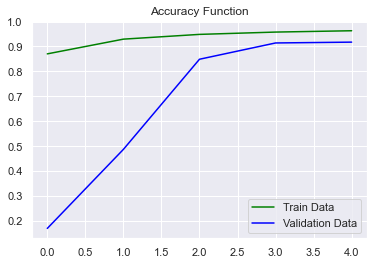

# ResNet Intel Image Classification
Building a ResNet model on intel image dataset

[Dataset on kaggle](https://www.kaggle.com/datasets/puneet6060/intel-image-classification)

## Contents
### Data Augmentation
Here we use image data generator for train and test data.

There are 14034 images belonging to 6 classes for train data and 3000 images for test data

### Modeling
Here we use a pre-trained model.

We use ResNet50 model with ImageNet weights and remove top of the model.

We add a dense layer with 6 units for the output layer

### Evaluation
* Accuracy and loss plotting

* 
### Prediction
Predicting an image using our model
